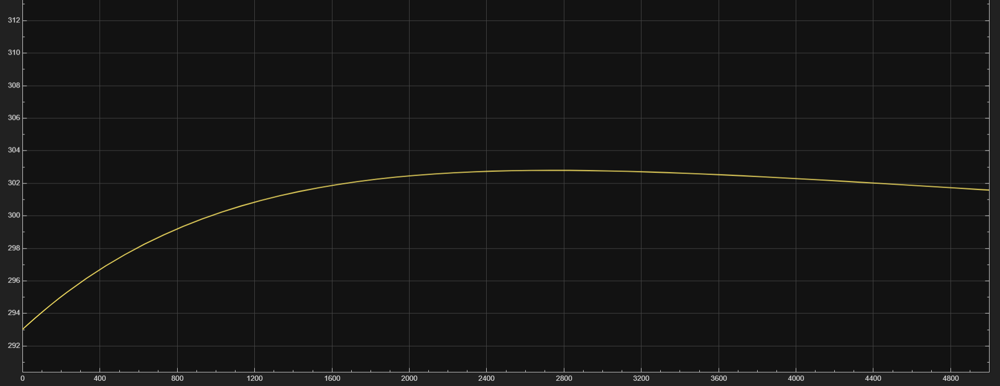
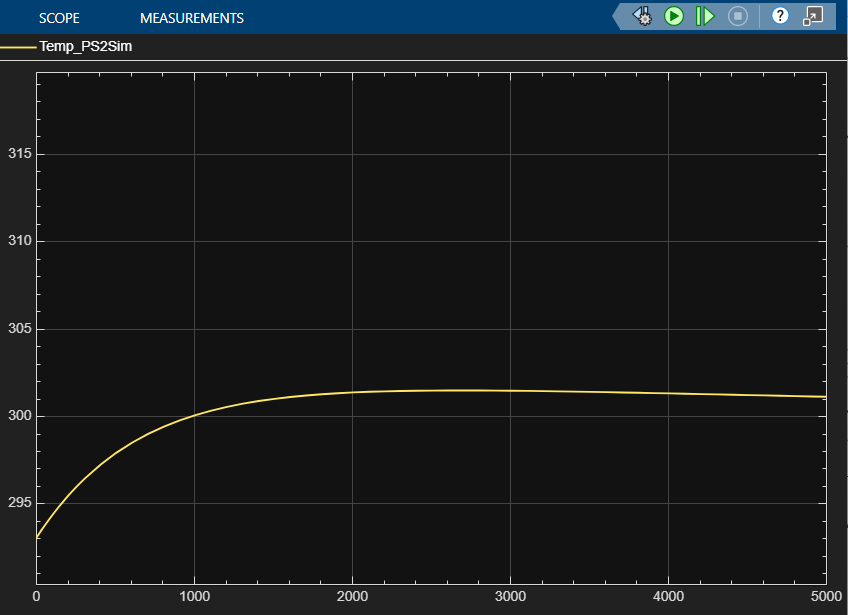
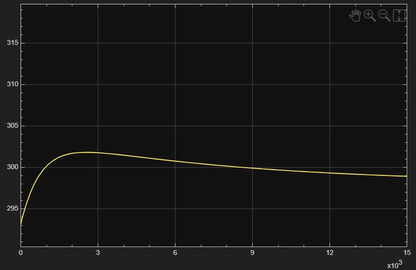

# 🚀 HVAC Thermal System Modeling & PID Control using MATLAB Simulink


A complete simulation of a room’s thermal behavior using **Simscape Thermal** along with a **PID-controlled HVAC system** for temperature regulation. This project demonstrates dynamic modeling, debugging, controller design, and system-level understanding using MATLAB/Simulink.

---

## 📌 Project Overview

This project models a room as a thermal mass exposed to a constant outside temperature via wall conduction. 

* **The System:** An HVAC system, modeled as a *Controlled Heat Flow Rate Source*, injects or removes heat to regulate room temperature.
* **The Control:** A PID controller adjusts HVAC power to maintain the room at a target temperature despite disturbances such as heat leakage.
* **Key Deliverables:**
    * Thermal system modeling
    * Simscape physical connections
    * PID controller design & tuning
    * Simulation and analysis

---

## 🧱 System Architecture

### Simscape Thermal Components (Physical Layer)
* **Thermal Mass:** Represents room air + thermal inertia ($C$).
* **Conductive Heat Transfer:** Models wall heat conduction ($R_{th}$).
* **Temperature Source:** Represents the constant outdoor temperature.
* **Controlled Heat Flow Rate Source:** Acts as the HVAC actuator.
* **Thermal Reference:** Ground node for zero heat flow.
* **Temperature Sensor:** Measures real-time room temperature.

### Simulink Components (Signal Layer)
* **PID Controller:** Computes the control effort.
* **Saturation:** Limits HVAC power to realistic values.
* **Simulink-PS / PS-Simulink Converters:** Interfaces between physical signals and control logic.
* **Scopes:** For visualizing temperature and heat flow over time.

---

## 🔍 Mathematical Model


The system is governed by the First Law of Thermodynamics (Energy Balance):

$$C \frac{dT}{dt} = Q_{\text{HVAC}} + Q_{\text{wall}}$$

### Wall Heat Flow (Newton's Law / Conduction)
$$Q_{\text{wall}} = \frac{T_{\text{out}} - T_{\text{room}}}{R_{\text{th}}}$$

### HVAC Control Logic (PID)
The HVAC output ($u$) represents $Q_{\text{HVAC}}$:
$$u = K_p e + K_i \int e \, dt + K_d \frac{de}{dt}$$

Where $e$ is the error signal ($T_{\text{setpoint}} - T_{\text{room}}$).

---

## 🎛️ PID Tuning

Iterative tuning was performed to achieve stability.

| Attempt | Kp | Ki | Kd | Notes |
| :--- | :--- | :--- | :--- | :--- |
| **1** | 200 | 0.1 | 0 | Slow response, underdamped. |
| **2** | 500 | 0.05 | 0 | Stable, minimal overshoot. |
| **3** | High | Low | 0 | Stable but slower convergence. |

**Final Result:** Tuning strategy #2 was selected for smooth and stable control.





---

## 📈 Simulation Highlights

### Temperature Behavior
* Initial room temperature starts at approx **293 K**.
* System rises to **300–303 K** (depending on setpoint).
* PID stabilizes temperature close to setpoint with minimal overshoot.
* Long-duration simulations confirm stable convergence.

### HVAC Power Response
* HVAC injects heat ($+Q$) when $T_{room} < T_{set}$.
* HVAC applies cooling ($-Q$) when $T_{room} > T_{set}$.
* Saturation limits prevent unrealistic infinite power spikes.

---

## 🚧 Repository Structure

```text
HVAC-Temperature-Control/
│
├── resources/
│   ├── project/
│   │   ├── fjRQtWiSIy7hIIj-Kmk87M7s21k
│   │   ├── NjSPEMsluLUyIpr2u1Js5bVPsOs
│   │   └── root
│   ├── Project.xml
│   └── rootp.xml
│
├── 1.png                         # Simulation result figure
├── 2.png                         # Simulation result figure
├── 3.png                         # Simulation result figure
├── HVAC Room Model.png           # Diagram of the Simulink model
├── HVAC_Project_Report.pdf       # Full project report
├── HVAC_Project.prj              # Simulink Project definition file
├── HVAC.m                        # MATLAB script for parameters/initialization
├── HVAC.slx                      # Main Simulink model file
└── README.md                     # Project documentation
